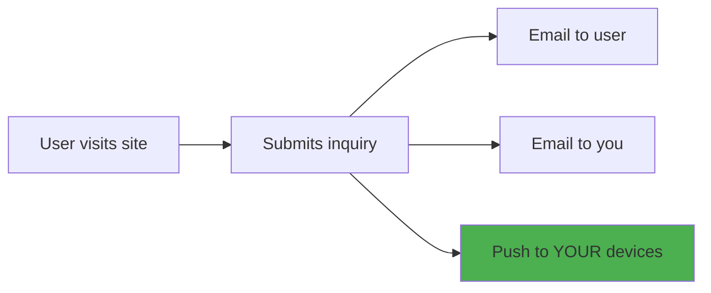
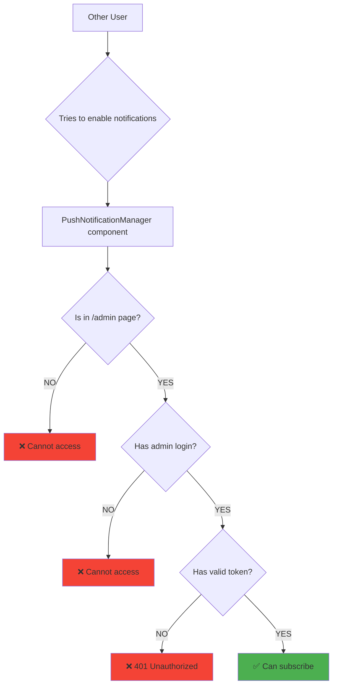
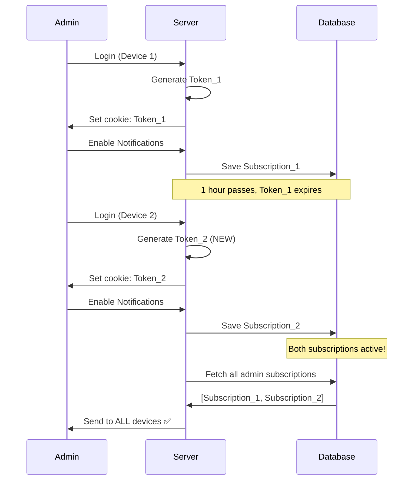
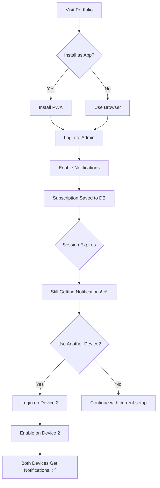
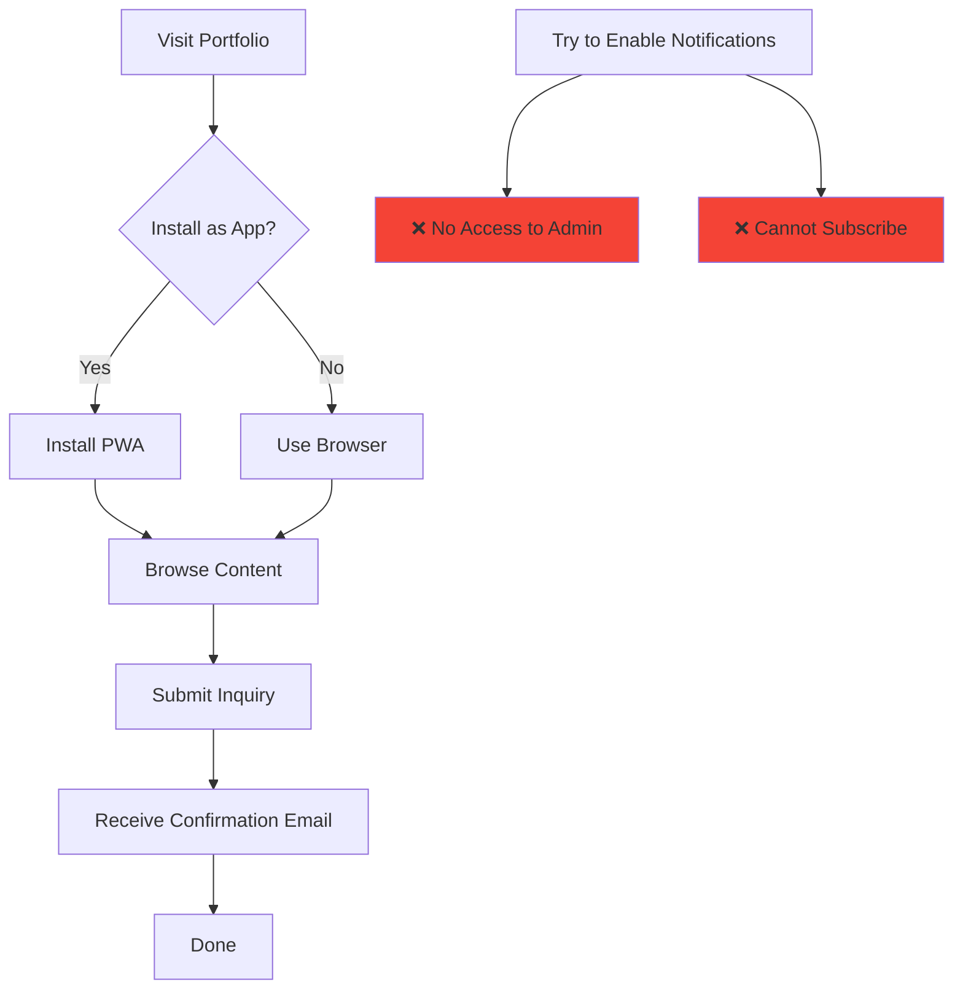

# Push Notification System - How It Works

## 🎯 Quick Answer: Who Gets Notifications?

| User Type | Can Subscribe? | Receives Inquiry Alerts? |
|-----------|----------------|-------------------------|
| **You (Admin)** | ✅ YES | ✅ YES |
| **Other Users** | ❌ NO | ❌ NO |

**Bottom Line**: Only YOU receive notifications about new inquiries, regardless of how many people install the app.

---

## 📱 Scenario 1: Other Users Submit Inquiries

### Question
> "I installed the app on my mobile. When OTHER users (browser or app) submit a contact form, will I receive notifications?"

### Answer: YES! ✅



**What happens:**
1. ✅ User receives confirmation email
2. ✅ You receive notification email  
3. ✅ **Push notification sent to ALL your subscribed devices**
4. ❌ User does NOT get any push notification

**Example:**
- Your phone has notifications enabled
- Random visitor submits inquiry from their browser
- Your phone buzzes with notification: *"🔔 New Inquiry Received"*
- Visitor gets nothing

---

## 🚫 Scenario 2: Other Users Install the App

### Question
> "If other users install my portfolio as an app, do they also receive notifications?"

### Answer: NO! ❌



**Why they CANNOT subscribe:**

1. **UI Protection**: PushNotificationManager only appears in `/admin` page *(requires login)*
2. **Authentication**: Admin page requires password
3. **Token Validation**: API checks for valid admin token
4. **Cookie Protection**: httpOnly cookies cannot be faked

**Even if they try via DevTools:**
```bash
# User tries to call API directly
curl -X POST /api/push/subscribe
# Response: 401 Unauthorized ❌
```

---

## ⏰ Scenario 3: Notifications After Logout

### Question
> "After I enable notifications and my session expires, do notifications still work?"

### Answer: YES! ✅ Subscriptions persist

### Timeline

````carousel
**Day 1: Initial Setup**

```
📱 iPhone
Login to admin → Generate Token A
Enable notifications → Save subscription to MongoDB

Database now has:
{
  subscription: iPhone_Data,
  userId: "admin",
  createdAt: "2024-01-01"
}
```

Status: ✅ Receiving notifications

<!-- slide -->

**1 Hour Later: Token Expires**

```
📱 iPhone
Token A expired (1 hour limit)
Session logged out

But subscription STILL in database!
{
  subscription: iPhone_Data,
  userId: "admin" ← Still here!
}
```

Status: ✅ **Still receiving notifications**

<!-- slide -->

**Day 7: Still Working**

```
No login for a week...
Token long expired...

Subscription still in database:
{
  subscription: iPhone_Data,
  userId: "admin",
  lastUsed: "2024-01-07" ← Updates on each inquiry
}
```

Status: ✅ **Still receiving notifications**

<!-- slide -->

**Day 30: Auto Cleanup**

```
If no inquiries for 30 days...

Automatic cleanup removes old subscriptions:
database.cleanup({ lastUsed < 30 days ago })
```

Status: ✅ If inquiries within 30 days  
Status: ⚠️ Subscription removed if inactive 30+ days

<!-- slide -->

**Day 31: Easy Restart**

```
Just login again and enable notifications!

New subscription created:
{
  subscription: iPhone_Data_New,
  userId: "admin",
  createdAt: "2024-01-31"
}
```

Status: ✅ **Receiving notifications again**
````

### Key Point

> **Token expiry ≠ Subscription expiry**
> 
> - **Token**: Temporary (1 hour) - Only for ADDING new subscriptions
> - **Subscription**: Permanent - Stored in database, works forever

---

## 🔄 Scenario 4: Multiple Devices

### Question
> "If I login on Device 2, does Device 1 stop receiving notifications?"

### Answer: NO! ✅ Both keep working

### How It Works

````carousel
**Device 1: iPhone**

```
Step 1: Login
Generate Token_iPhone (64 random chars)
Set cookie: admin_token=abc123...

Step 2: Enable Notifications
Save to database:
{
  _id: "sub_001",
  subscription: iPhone_push_data,
  userId: "admin"
}

Status: ✅ Receiving notifications
```

<!-- slide -->

**Device 2: Laptop (Later)**

```
Step 1: Login
Generate Token_Laptop (NEW random 64 chars)
Set cookie: admin_token=xyz789...

Token_iPhone still expired, but subscription exists!

Step 2: Enable Notifications  
Save to database:
{
  _id: "sub_002",
  subscription: Laptop_push_data,
  userId: "admin"
}

Status: ✅ Receiving notifications
```

<!-- slide -->

**Database State**

```javascript
push_subscriptions collection:
[
  {
    _id: "sub_001",
    subscription: iPhone_push_data,
    userId: "admin",
    createdAt: "2024-01-01T10:00:00Z"
  },
  {
    _id: "sub_002", 
    subscription: Laptop_push_data,
    userId: "admin",
    createdAt: "2024-01-15T14:30:00Z"
  }
]
```

Both subscriptions active! ✅

<!-- slide -->

**When Inquiry Arrives**

```javascript
// Server retrieves ALL admin subscriptions
const subs = await getPushSubscriptions("admin")
// Returns: [iPhone_data, Laptop_data]

// Sends to BOTH devices
for (const sub of subs) {
  await sendPushNotification(sub, {
    title: "🔔 New Inquiry",
    body: "John Doe is interested in Vocal Music"
  })
}
```

**Result:**
- 📱 iPhone buzzes ✅
- 💻 Laptop shows notification ✅

<!-- slide -->

**Adding More Devices**

```
You can subscribe from:
✅ iPhone Safari
✅ MacBook Chrome
✅ iPad Firefox
✅ Android Chrome
✅ Windows Edge

All receive notifications simultaneously!
```
````

---

## 🔐 Security Summary

### How Token Rotation Works



### Protection Layers

| Layer | Protection | Prevents |
|-------|------------|----------|
| **UI** | Component in `/admin` only | Casual users |
| **Auth** | Password required | Unauthorized access |
| **Token** | 64-char random token | API abuse |
| **Cookie** | httpOnly, sameSite | XSS, CSRF attacks |
| **Validation** | Server-side checks | Direct API calls |

---

## 📊 Complete User Journey

### Admin (You)



### Regular User



---

## 💡 Common Questions

### Q: Will I get spammed with notifications?

**A:** Only when someone submits an inquiry. No random notifications.

### Q: Can I disable notifications temporarily?

**A:** Yes! Go to admin page → Click "Disable Notifications"

### Q: What if I change phones?

**A:** Login on new phone → Enable notifications → Both old + new phones get alerts

### Q: Do notifications work offline?

**A:** Device must be online to receive push notifications

### Q: Battery impact?

**A:** Minimal - uses browser's native push service

### Q: Privacy concerns?

**A:** All data stored in your MongoDB, zero external services

---

## 🎯 TL;DR - Cheat Sheet

| Statement | True/False |
|-----------|------------|
| I receive notifications when users submit inquiries | ✅ TRUE |
| Other users receive notifications | ❌ FALSE |
| Notifications stop when session expires | ❌ FALSE (keep working!) |
| Multiple devices can receive simultaneously | ✅ TRUE |
| Token rotation breaks old subscriptions | ❌ FALSE (subscriptions persist) |
| Anyone can subscribe via API | ❌ FALSE (token required) |
| I need to stay logged in | ❌ FALSE (subscriptions saved) |
| Subscriptions last forever | ⚠️ ALMOST (30 day cleanup) |

---

## 📞 Need Help?

1. Check [PUSH_NOTIFICATION_SECURITY.md](file:///home/mani/mani/vijay/PUSH_NOTIFICATION_SECURITY.md) for security details
2. Check [PUSH_NOTIFICATIONS_GUIDE.md](file:///home/mani/mani/vijay/PUSH_NOTIFICATIONS_GUIDE.md) for setup guide
3. Test your setup:
   - Login → Enable notifications
   - Submit test inquiry from another browser
   - Should receive notification within seconds!

---

**Last Updated**: 2026-01-29  
**Status**: ✅ Production Ready & Secure
